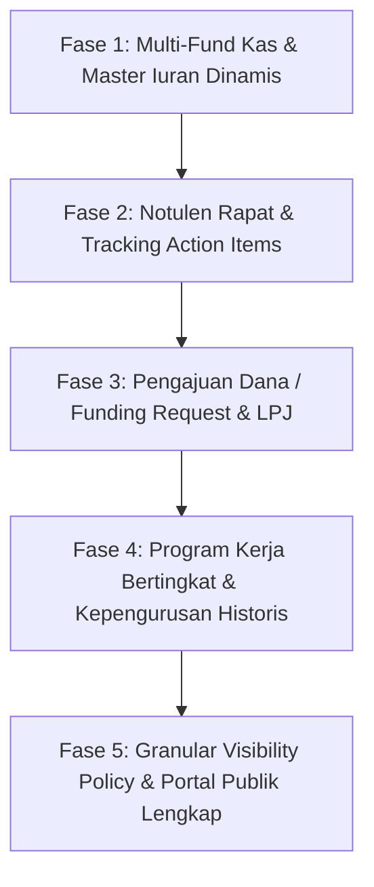

# Roadmap & Desain Integrasi Fitur Unggulan Komunitas RT/RW

Dokumen perencanaan dan desain adopsi fitur dari *Community Operating Platform Mega Spec* yang disesuaikan dan di-improve untuk kebutuhan nyata operasional RT/RW dan kepemudaan (Karang Taruna).

---

## 1. Visi & Konteks Adaptasi

Sistem `Sitransparan RT/RW` saat ini sudah memiliki fondasi multi-tenant PostgreSQL (schema-per-tenant), RBAC, isolasi data kuat, dan audit trail transaksi append-only.

Dari analisa *Mega Spec*, terdapat 6 pilar fungsional bernilai tinggi yang perlu kita adopsi dan sempurnakan agar sistem tidak hanya menjadi aplikasi kas/warga biasa, melainkan **Sistem Operasi Tata Kelola Lingkungan RT/RW yang Lengkap dan Berkelanjutan**.

---

## 2. Peta Fitur & Improvement Khusus Kebutuhan Lingkungan

### 2.1 Multi-Fund Management (Banyak Kantong Kas Mandiri)
- **Kebutuhan Nyata:**
  Di lingkungan RT sering terjadi pencampuran uang. Uang duka/sosial terpakai untuk beli semen pos kamling, atau uang kas Karang Taruna terpakai untuk operasional RT.
- **Fitur & Solusi:**
  - Tiap RT dapat membuat banyak "Kantong Kas" (*Funds*), contoh:
    1. *Kas Operasional RT* (listrik pos, sampah, ronda)
    2. *Dana Sosial & Kematian* (santunan warga sakit/meninggal)
    3. *Kas Karang Taruna / Pemuda* (kegiatan 17-an, olahraga, turnamen)
    4. *Dana Pembangunan / Fasilitas* (perbaikan jalan, paving, balai warga)
  - Transaksi keluar/masuk wajib terhubung ke salah satu Kantong Kas.
  - Ringkasan Saldo otomatis terpisah per kantong dan ada total konsolidasi.
- **Improvement:**
  - Fitur **Transfer Antar-Kantong Kas** (misal: Alokasi subsidi dari Kas Utama RT ke Kas Karang Taruna) dengan bukti memo/catatan persetujuan.

---

### 2.2 Workflow Pengajuan & Pencairan Dana (Funding Request & LPJ)
- **Kebutuhan Nyata:**
  Sering terjadi panitia acara meminta uang tunai tanpa rincian tertulis atau tanpa bukti nota setelah acara selesai, menimbulkan fitnah/kecurigaan antar-warga.
- **Alur Kerja Transparan:**
  ```text
  Panitia / Seksi
  (Buat Form Pengajuan Dana + Rencana Anggaran)
         ↓
  Ketua RT / Bendahara
  (Review & Beri Persetujuan / Approval)
         ↓
  Pencairan Dana (Disbursement)
  (Status: 'disbursed', dana keluar dari Kas)
         ↓
  Laporan Pertanggungjawaban (LPJ) & Upload Nota
  (Upload struk fisik + sisa uang dikembalikan ke Kas)
         ↓
  Verifikasi Selesai (Closed)
  ```
- **Improvement:**
  - Auto-reminder kepada penanggung jawab acara jika LPJ belum di-upload dalam kurun waktu 7 hari setelah event selesai.

---

### 2.3 Notulen Rapat Digital & Tracking Tugas Warga (Meetings & Action Items)
- **Kebutuhan Nyata:**
  Hasil rapat bulanan RT sering lupa dicatat, hilang di grup WhatsApp, atau warga yang tidak hadir tidak mengetahui apa saja yang diputuskan.
- **Fitur & Solusi:**
  - Form pencatatan notulen terstruktur:
    - Judul & Tanggal Rapat.
    - Daftar Hadir Warga.
    - Poin Diskusi & Kesimpulan.
    - **Daftar Keputusan (Decisions):** Ringkasan aturan baru atau hasil voting.
    - **Tugas Tindak Lanjut (Action Items):** Tugas spesifik $\rightarrow$ PIC Warga $\rightarrow$ Target Tanggal Selesai $\rightarrow$ Status (*Open / In Progress / Done*).
- **Improvement:**
  - Warga yang tidak hadir bisa langsung membaca notulen dan hasil keputusan di Portal Warga / Public Info (sesuai tingkat visibility).

---

### 2.4 Struktur Kepengurusan & Riwayat Masa Bakti (Temporal Governance)
- **Kebutuhan Nyata:**
  Setiap 3 atau 5 tahun terjadi pergantian Ketua RT, Bendahara, atau Ketua Karang Taruna. Dokumen dan riwayat kepengurusan lama sering lenyap.
- **Fitur & Solusi:**
  - Manajemen Periode Kepengurusan (Masa Bakti), contoh: `Periode 2024 - 2027`.
  - Struktur Jabatan Dinamis: Ketua RT, Sekretaris, Bendahara, Seksi Keamanan, Seksi Lingkungan Hidup, Pengurus Karang Taruna.
  - Penugasan Warga ke Jabatan dengan rentang waktu (`effective_from` s.d. `effective_until`).
- **Improvement:**
  - Warga generasi baru bisa melihat "Buku Sejarah & Hall of Fame" mantan pengurus RT dan Karang Taruna terdahulu di portal transparansi publik.

---

### 2.5 Program Kerja Bertingkat (Programs $\rightarrow$ Activities $\rightarrow$ Budgets)
- **Kebutuhan Nyata:**
  Perencanaan tahunan RT/Karang Taruna tidak terpantau progres dan anggarannya secara menyeluruh.
- **Fitur & Solusi:**
  - **Program Kerja Tahunan:** Payung program (contoh: *Program Lingkungan Hijau & Asri 2026*).
  - **Aktivitas/Event Turunan:**
    - Kerja Bakti Rutin Triwulan I.
    - Pengadaan Bibit Pohon.
    - Fogging DBD Lingkungan.
  - Perbandingan otomatis: **Rencana Anggaran (Budget) vs Realisasi Aktual (Actual Spending)**.

---

### 2.6 Granular Visibility Data (Publik vs Warga vs Pengurus)
- **Kebutuhan Nyata:**
  Ada data yang boleh dilihat masyarakat luas (contoh: jadwal kerja bakti, pengumuman peringatan 17-an, ringkasan total saldo kas), tetapi ada data yang hanya boleh diakses warga terdaftar (detail mutasi iuran, notulen rapat internal), dan data yang hanya boleh dilihat pengurus (NIK lengkap, draft anggaran).
- **Matriks Visibility:**
  | Tingkat Akses | Deskripsi & Contoh Data |
  |---|---|
  | `PUBLIC` | Pengumuman umum, agenda kegiatan warga, ringkasan kas global. |
  | `WARGA_ONLY` | Notulen rapat, rincian pembayaran iuran rumah tangga sendiri. |
  | `PENGURUS_ONLY`| Data kependudukan lengkap warga, draf pengajuan dana internal. |
  | `CONFIDENTIAL` | Dokumen hukum/keuangan internal tertentu. |

---

## 3. Rencana Tahapan Rilis (Implementation Phases)



### Fase 1: Multi-Fund Kas & Master Data Iuran (Siap Mulai)
1. Penambahan tabel `funds` (Kantong Kas) per schema tenant.
2. Relasi transaksi kas ke `fund_id`.
3. UI filter dan perpindahan kas per kantong dana.

### Fase 2: Notulen Rapat & Action Items
1. Tabel `meetings`, `meeting_attendees`, `meeting_decisions`, `meeting_action_items`.
2. UI Buat Notulen dan Kanban/Daftar tugas tindak lanjut warga.

### Fase 3: Funding Request & LPJ Digital
1. Tabel `funding_requests`, `funding_request_items`, `disbursements`.
2. Alur Approval Ketua RT/Bendahara dan form submit LPJ dengan nota struk.

---

## 4. Keuntungan Bagi Pengurus & Warga

1. **Anti Salah Paham & Transparan:** Warga percaya penuh pada pengurus karena setiap rupiah dan keputusan tercatat rapi.
2. **Pengurus Tidak Lelah Manual:** Laporan kas dan LPJ ter-generate otomatis, tidak perlu rekap ulang di Excel manual tiap akhir bulan.
3. **Dokumentasi Abadi:** Pergantian pengurus RT/Karang Taruna berjalan mulus tanpa kehilangan data masa lalu.
