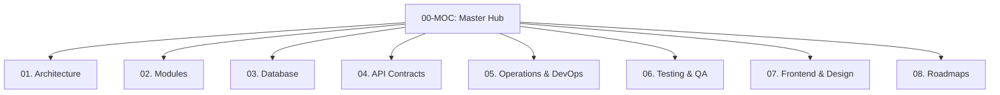

# 🌐 SiTransparan RT/RW — Map of Content (MOC)

Selamat datang di **Obsidian Knowledge Vault** untuk **SiTransparan RT/RW**, platform SaaS multi-tenant tata kelola RT/RW modern yang transparan, akuntabel, dan berbasis PWA.

🗺️ **Visual Canvas**: Buka visualisasi relasi sistem grafis interaktif di **[[Architecture-Map.canvas|Architecture Map Canvas]]**.

---

## 🧭 Navigasi 8 Pilar Dokumentasi

### 🏛️ [[01-architecture/system-overview|01. Arsitektur & Prinsip Sistem]]
- [[01-architecture/system-overview|System Overview & Clean Architecture]] — Layering `delivery -> usecase -> repository -> domain`.
- [[01-architecture/multi-tenancy|Multi-Tenancy Model]] — Isolasi skema PostgreSQL (`tenant_<slug>`), auto-provisioning, dan soft-delete.
- [[01-architecture/authentication-and-rbac|Authentication & RBAC Matrix]] — JWT HS256, 3 Role (`superadmin`, `admin_rt`, `resident`), AES-256-GCM NIK.
- [[01-architecture/subdomain-and-routing|Subdomain & Host Routing]] — Traefik v3.6, `TENANT_BASE_DOMAIN`, deteksi host vs path slug.
- [[01-architecture/audit-logging|Audit Logging]] — Pelacakan audit trail lintas skema di `public.audit_logs`.

### 📦 [[02-modules/kependudukan-and-houses|02. Modul & Fitur Bisnis]]
- [[02-modules/kependudukan-and-houses|Kependudukan & Manajemen Rumah]] — Kartu Keluarga, NIK hashing, verifikasi warga, QR token rumah.
- [[02-modules/keuangan-and-dues|Keuangan & Kas RT]] — Multi-kantong kas (`funds`), kategori iuran, pencatatan iuran per tanggal, append-only ledger.
- [[02-modules/kegiatan-and-events|Kegiatan, Agenda & RAPB Event]] — Rencana anggaran (RAB), kepanitiaan, sponsor, dan laporan LPJ kegiatan warga.
- [[02-modules/bank-sampah|Bank Sampah]] — Kategori dinamis, sistem bagi hasil warga-pemuda, buku tabungan sampah KK.
- [[02-modules/karang-taruna-and-structure|Karang Taruna & Struktur Kepengurusan]] — Periode kepengurusan, bagan hierarki RT & KT, portal publik.
- [[02-modules/inventaris-and-assets|Inventaris & Peminjaman Aset]] — Master aset RT, siklus peminjaman, pelacakan kondisi barang.
- [[02-modules/notulen-and-meetings|Notulen & Manajemen Pertemuan]] — Agenda musyawarah, daftar hadir, butir keputusan, action items, tingkat kerahasiaan.
- [[02-modules/kabar-and-documents|Kabar Warga & Dokumen]] — Pengumuman multi-media, komentar warga, repository dokumen RT/RW.
- [[02-modules/aspirasi-and-needs|Aspirasi & Kebutuhan Komunitas]] — Usulan warga (anonim/publik), penanganan status, community needs.
- [[02-modules/portal-transparansi-publik|Portal Transparansi Publik]] — Feed `/kabar`, `/usulan`, `/agenda`, `/karang-taruna`, `/bank-sampah`.
- [[02-modules/social-and-polls|Interaksi Sosial & Polling]] — Reaksi warga, voting jajak pendapat (2–6 opsi), gamifikasi lencana.
- [[02-modules/notifikasi-webpush|Notifikasi & Web Push]] — Standar VAPID web push, pengumuman broadcast per tenant.

### 🗄️ [[03-database/schema-inventory|03. Basis Data & Migrasi]]
- [[03-database/schema-inventory|Katalog Skema & Tabel]] — Skema `public` vs 27+ tabel dalam `tenant_<slug>`.
- [[03-database/migrations-history|Buku Rekam Migrasi (000001–000050)]] — Histori lengkap migrasi raw SQL.
- [[03-database/data-integrity-rules|Aturan Integritas Data & Proteksi]] — Soft-delete, enkripsi NIK, aturan immutability transaksi kas.

### 📡 [[04-api-contracts/api-inventory|04. Kontrak API & Spesifikasi]]
- [[04-api-contracts/api-inventory|Inventaris Endpoint API]] — Pemetaan lengkap HTTP Method, Role, dan URL path.
- [[04-api-contracts/openapi-spec|Spesifikasi OpenAPI / Swagger]] — Sinkronisasi dengan `openapi.yaml`.

### ⚙️ [[05-operations-devops/environment-and-setup|05. Operasional & DevOps]]
- [[05-operations-devops/environment-and-setup|Lingkungan & Konfigurasi]] — Variabel lingkungan, MinIO S3, port mapping.
- [[05-operations-devops/docker-and-traefik|Docker & Traefik v3.6]] — Konfigurasi reverse proxy, SSL/TLS, wildcard routing.
- [[05-operations-devops/sdlc-and-promotion-workflow|SDLC & Alur Promosi Lingkungan]] — Aturan wajib `dev -> staging -> main`, zero database overwrite.
- [[05-operations-devops/release-checklist|Checklist Rilis Produksi]] — Prosedur verifikasi pra-rilis.

### 🧪 [[06-testing-qa/e2e-playwright-suite|06. Pengujian & Jaminan Mutu]]
- [[06-testing-qa/e2e-playwright-suite|E2E Playwright Suite]] — 65+ automated scenarios, multi-tenant browser assertions.
- [[06-testing-qa/backend-test-suite|Backend Security & Integration Tests]] — Go unit & cross-tenant security suites.
- [[06-testing-qa/audit-reports-archive|Arsip Laporan Audit & Bugfix]] — Rekam jejak resolusi bug dan temuan audit.

### 🎨 [[07-frontend-design/apple-design-system|07. Desain Frontend & Performa]]
- [[07-frontend-design/apple-design-system|Apple-Style Design Tokens]] — Typography, translucent blur, haptic UI, palet netral.
- [[07-frontend-design/anti-ai-slop-rules|Aturan Anti-AI-Slop]] — Larangan native `<select>`, larangan tombol dekoratif tanpa fungsi.
- [[07-frontend-design/bundle-and-performance|Bundle Splitting & Optimasi Performa]] — Vite chunking, Latin subset fonts, PWA cache strategy.

### 🚀 [[08-roadmaps/community-features-roadmap|08. Rencana Masa Depan]]
- [[08-roadmaps/community-features-roadmap|Roadmap Fitur Komunitas]] — Koperasi RT, panic button, integrasi CCTV lingkungan.
- [[08-roadmaps/auto-payment-integration|Integrasi Pembayaran Otomatis]] — Payment gateway QRIS / VA untuk iuran warga.
- [[08-roadmaps/distributed-caching-and-scaling|Distributed Caching & Rate Limiting (Redis / Valkey)]] — Rencana transisi scaling multi-instance backend.

---

## 🔑 Kredensial Bawaan (Development / Testing)

| Peran | Email | Kata Sandi | Cakupan Akses |
|---|---|---|---|
| **Super Admin** | `abi@gmail.com` | `admin123` | Platform global (`/admin/tenants`, `/admin/users`) |
| **Admin RT** | `admin@sitransparan.rt` | `password123` | Tenant `sitransparan-rt` |
| **Warga (Resident)** | *Registrasi mandiri di `/login`* | *Password buatan warga* | Portal warga & partisipasi |

---

## 🔌 Alokasi Port Lokal

- Frontend: `http://localhost:3000`
- Backend API: `http://localhost:8081` (host) / `8080` (internal docker)
- PostgreSQL 16: `localhost:5432`
- MinIO S3 API: `http://localhost:9000` (Console: `http://localhost:9001`)
- Traefik Dashboard: `http://localhost:8080`
