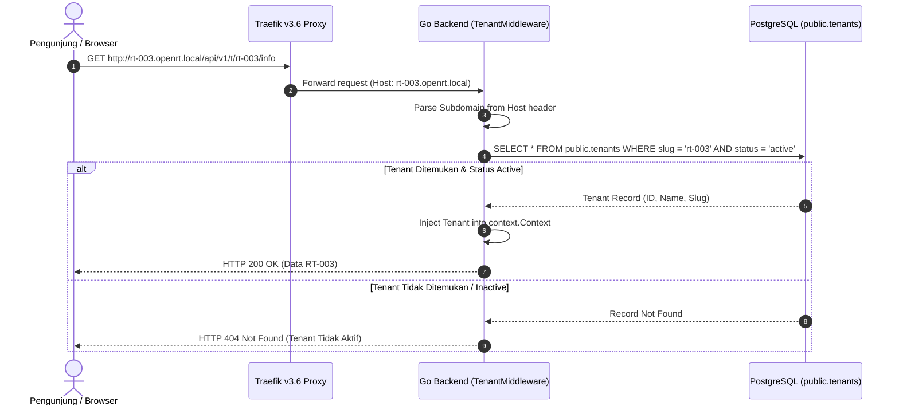

# 🌐 Subdomain & Host Routing Architecture

SiTransparan RT/RW mendukung routing berbasis subdomain untuk memberikan identitas profesional pada setiap RT (misal: `rt-003.iscube.web.id` atau dev `rt-003.openrt.local`).

---

## 1. Skema Resolusi Hostname vs Path Slug



---

## 2. Aturan Keamanan Hostname Matching

Hostname digunakan sebagai sarana **penemuan (discovery)**, bukan sebagai alat bypass keamanan:
1. **Verifikasi Status Aktif**: Subdomain harus terdaftar pada `public.tenants` dengan status `active`. Jika tenant berstatus `inactive` atau telah di-soft-delete, server merespons HTTP 404.
2. **Konsistensi Path Slug vs Hostname**: Pada endpoint publik (`/api/v1/t/{slug}/...`), jika request dilakukan via subdomain tenant (`rt-003.openrt.local`), maka `{slug}` di URL path **wajib identik** dengan subdomain hostname. Jika berbeda (misal host `rt-003` memanggil slug `rt-004`), request ditolak dengan **HTTP 404**.
3. **Pencocokan Token JWT**: Untuk request terautentikasi, klaim `tenant_id` pada JWT **wajib cocok** dengan tenant dari subdomain hostname (ketidakcocokan menghasilkan **HTTP 403 Forbidden**).
4. **Bypass Terkendali untuk Superadmin**: Peran `superadmin` yang melakukan audit platform diizinkan mengakses konteks lintas subdomain tanpa ditolak oleh pencocokan JWT `tenant_id`.

---

## 3. Konfigurasi Traefik v3.6

Traefik v3.6 menggunakan sintaks regex berjangkar (anchored regex) untuk mencocokkan wildcard subdomain:

```yaml
# infrastructure/docker-compose.yml
labels:
  - "traefik.enable=true"
  - "traefik.http.routers.frontend.rule=HostRegexp(`^[a-z0-9-]+\\.${TENANT_BASE_DOMAIN}$`)"
  - "traefik.http.routers.frontend.entrypoints=web"
```

> ⚠️ **Catatan Penting Traefik v3**:
> Sintaks lama Traefik v2 seperti `{subdomain:[a-z0-9-]+}.${TENANT_BASE_DOMAIN}` **tidak didukung** di Traefik v3 dan akan menyebabkan aturan routing diabaikan. Selalu gunakan `HostRegexp('^[a-z0-9-]+\\....$')`.

---

## 4. Hubungan Lintas Dokumen

- [[01-architecture/multi-tenancy|Model Isolasi Multi-Tenancy]]
- [[05-operations-devops/docker-and-traefik|Konfigurasi Traefik & Docker]]
- [[02-modules/portal-transparansi-publik|Portal Transparansi Publik]]
- [[00-MOC|Kembali ke MOC]]
