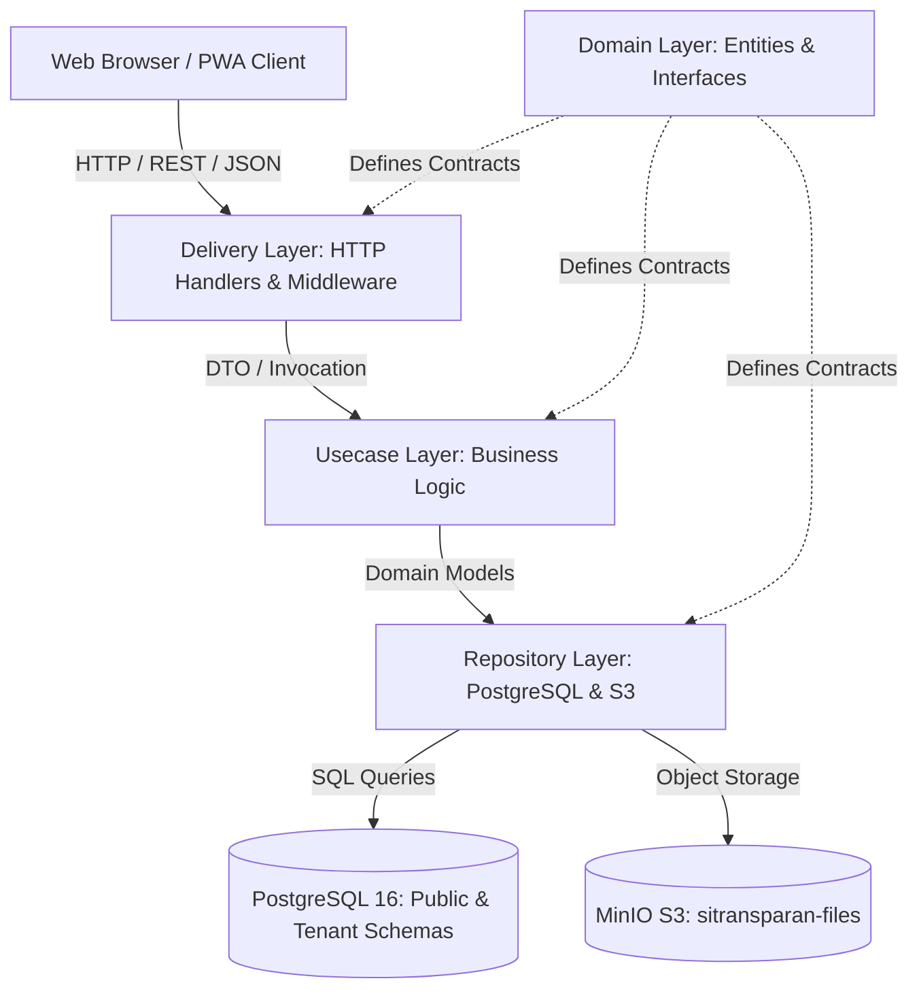

# 🏛️ System Overview & Clean Architecture

Aplikasi **SiTransparan RT/RW** dibangun dengan prinsip pemisahan tanggung jawab yang ketat (Separation of Concerns) mengadopsi **Clean Architecture** (Onion / Hexagonal Architecture) di sisi backend Go, serta arsitektur berbasis komponen modular di sisi frontend React TypeScript.

---

## 1. Lapisan Backend (Clean Architecture)

Backend diimplementasikan dalam bahasa **Go 1.25** (`backend/go.mod`) menggunakan standard library `net/http` dengan method-pattern `ServeMux` bawaan Go 1.22+.

### A. Lapisan Domain (`backend/internal/domain/`)
Merupakan inti bisnis independen yang tidak bergantung pada framework atau database apa pun.
- **Entitas Inti**: Mendefinisikan struct bisnis seperti `Resident`, `House`, `DuesPayment`, `FinancialTransaction`, `Meeting`, `InventoryItem`, dll.
- **Interface Kontrak**: Mendefinisikan interface repository (e.g., `FinancialRepository`, `ResidentRepository`) dan interface usecase.
- **Konstanta Peran**: Mendefinisikan `RoleSuperAdmin = "superadmin"`, `RoleAdminRT = "admin_rt"`, `RoleResident = "resident"`.

### B. Lapisan Use Case (`backend/internal/usecase/`)
Mengorkestrasikan alur bisnis, validasi logika, dan aturan domain.
- Menjamin aturan integritas bisnis (misalnya verifikasi saldo kantong kas saat pengeluaran, agregasi RAPB event).
- Mengenkripsi dan mendekripsi data sensitif (misalnya NIK warga via `crypto.EncryptGCM`).
- Tidak mengenal SQL mentah maupun objek HTTP `http.ResponseWriter`.

### C. Lapisan Repository (`backend/internal/repository/`)
Mengimplementasikan persistensi data ke PostgreSQL dan MinIO Object Storage.
- Menggunakan helper `TenantTable(ctx, "table_name")` untuk meresolusi nama tabel ber-skema dinamis (`tenant_<slug>.<table_name>`).
- Seluruh query menggunakan parameterized SQL (`$1, $2`) untuk mencegah SQL injection.
- Mengimplementasikan pencarian cepat NIK menggunakan hash HMAC-SHA256 (`nik_hash`).

### D. Lapisan Delivery (`backend/internal/delivery/http/`)
Pintu masuk request HTTP/REST.
- **Routing**: `backend/cmd/server/main.go` mendaftarkan rute publik, authenticated, admin, dan superadmin.
- **Middleware**:
  - `tenant_middleware.go`: Memvalidasi hostname subdomain, mencocokkan tenant token JWT dengan tenant domain, serta menginjeksi context tenant.
  - `auth_middleware.go`: Memverifikasi JWT HS256, mengekstrak claims `user_id`, `tenant_id`, `role`.
  - `role_middleware.go`: Menjaga akses berbasis peran (`RequireAnyRole`, `RequireSuperAdmin`).
  - `rate_limit_middleware.go`: Perlindungan burst request berbasis IP client (in-memory rate limiter).

---

## 2. Lapisan Frontend (React TypeScript Modular)

Frontend dibangun dengan **React 18**, **TypeScript**, dan **Vite** yang dioptimalkan untuk mobile PWA:

- **State Management**:
  - **Server State**: `@tanstack/react-query` v5 untuk caching, background refetch, dan optimistik updates.
  - **Client State**: `zustand` (`frontend/src/store/useAuthStore.ts`) untuk token autentikasi, info user, dan active tenant.
- **Dekomposisi Komponen**:
  - Halaman kompleks dipecah menjadi tab-tab modular dan modal terpisah (`frontend/src/components/<module>/`).
  - Tidak ada komponen monolitis raksasa (>1,000 baris). Seluruh sub-views diisolasi ke dalam sub-folder modular.
- **PWA & Offline First**:
  - `vite-plugin-pwa` dengan Workbox custom service worker (`frontend/src/sw.ts`).
  - IndexedDB cache untuk operasional offline data warga & iuran.

---

## 3. Peta Tautan Vault

- [[01-architecture/multi-tenancy|Arsitektur Multi-Tenancy & Isolasi Skema]]
- [[01-architecture/authentication-and-rbac|Autentikasi & Matriks RBAC]]
- [[01-architecture/subdomain-and-routing|Routing Subdomain & Traefik Proxy]]
- [[01-architecture/audit-logging|Spesifikasi Audit Logging]]
- [[00-MOC|Kembali ke MOC]]
