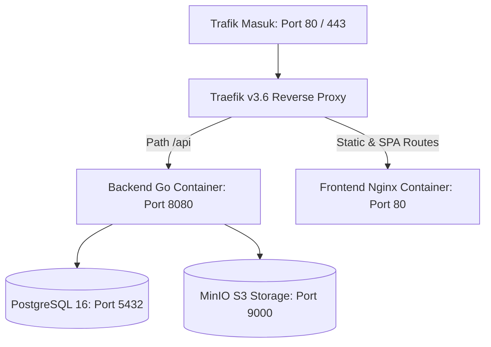

# 🐳 Docker & Traefik v3.6 Routing

Infrastruktur SiTransparan RT/RW berjalan dalam ekosistem Docker Compose yang diproteksi dan diarahkan oleh **Traefik v3.6+**.

---

## 1. Topologi Container



---

## 2. File Docker Compose

Tersedia file konfigurasi per lingkungan di direktori `infrastructure/`:
- `docker-compose.yml`: Lingkungan pengujian dev lokal (`openrt.local`).
- `docker-compose.staging.yml`: Lingkungan integrasi staging (`*-staging.iscube.web.id`).
- `docker-compose.prod.yml`: Lingkungan operasional live produksi (`*.iscube.web.id`).

---

## 3. Aturan Krusial Traefik v3.6

- Traefik versi 3.6+ wajib digunakan karena image Traefik versi lama mematok Docker client API v1.24 yang ditolak oleh Docker Engine modern (`client version 1.24 is too old`).
- Gunakan aturan routing berbasis `HostRegexp`:
  ```yaml
  labels:
    - "traefik.enable=true"
    - "traefik.http.routers.frontend.rule=HostRegexp(`^[a-z0-9-]+\\.${TENANT_BASE_DOMAIN}$`)"
  ```

---

## 4. Hubungan Lintas Dokumen

- [[01-architecture/subdomain-and-routing|Arsitektur Subdomain]]
- [[05-operations-devops/sdlc-and-promotion-workflow|Alur Promosi Lingkungan]]
- [[00-MOC|Kembali ke MOC]]
