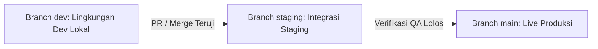

# 🚀 SDLC & Alur Promosi Lingkungan (Strict Workflow)

Seluruh agen AI dan developer **WAJIB** mengikuti alur promosi kode berikut tanpa pengecualian.

---

## 1. Aturan Tiga Lingkungan (Three-Tier Promotion)

### A. Seluruh Perubahan Dimulai dari Branch `dev`
- **Dilarang keras** melakukan commit atau edit kode langsung di branch `staging` atau `main`.
- Fitur baru, perbaikan bug, refactoring, atau penambahan pengujian wajib dibuat dan diverifikasi pertama kali di branch `dev`.

### B. Promosi ke Lingkungan Staging (`staging`)
- Setelah branch `dev` teruji stabil dan seluruh suite tes lolos, perubahan di-merge ke branch `staging`.
- Lingkungan `staging` digunakan untuk pengujian integrasi akhir (`*-staging.iscube.web.id`).

### C. Promosi ke Lingkungan Produksi (`main`)
- Setelah pengujian di staging terbukti bebas regresi, perubahan di-merge ke branch `main`.
- Branch `main` otomatis memicu pipeline CI/CD produksi (`*.iscube.web.id`).

---

## 2. Kebijakan Integritas & Proteksi Data (Zero Overwrite)

- **Data Produksi adalah Kebenaran Mutlak**:
  - Dilarang menimpa (overwrite), mereset, atau menyalin dump database pengujian ke database produksi.
  - Setiap migrasi ke staging dan produksi hanya boleh menambahkan perubahan skema (`ALTER TABLE`, `CREATE TABLE`) tanpa merusak data warga atau transaksi yang sudah ada.
  - Deploy hanya membangun ulang container kode aplikasi (`docker compose build && docker compose up -d`).

---

## 3. Kebijakan Dokumentasi Hidup (Living Documentation Governance)

- **Sinkronisasi Kode & Dokumen Adalah Satu Kesatuan**:
  - Setiap PR atau merge commit yang memodifikasi endpoint API, skema DB, atau alur bisnis UI **wajib** menyertakan pembaruan dokumen terkait di pilar Obsidian Vault `docs/`.
  - Agen AI dan pengembang dilarang menandai pekerjaan "Done" jika kode berubah tetapi dokumen pilar di `docs/` tidak disinkronkan.
  - Peta relasi `docs/Architecture-Map.canvas` dan `docs/00-MOC.md` wajib dipelihara agar selalu mencerminkan kondisi terbaru aplikasi.

---

## 4. Hubungan Lintas Dokumen

- [[05-operations-devops/release-checklist|Checklist Rilis Produksi]]
- [[00-MOC|Kembali ke MOC]]
