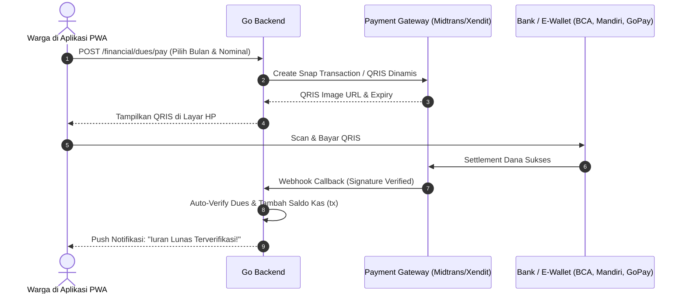

# 💳 Integrasi Pembayaran Otomatis (QRIS & Virtual Account)

Transisi dari verifikasi manual bukti transfer menjadi rekonsiliasi otomatis real-time menggunakan payment gateway Indonesia (Midtrans / Xendit).

---

## 1. Arsitektur Alur Pembayaran QRIS Dinamis

---

## 2. Manfaat & Efisiensi Operasional

- **Zero Manual Verification**: Mengeliminasi beban bendahara RT dalam mencocokkan struk mutasi bank satu per satu.
- **Kwitansi Digital Instan**: Warga langsung mendapatkan bukti potong dan stempel lunas digital begitu transaksi selesai.

---

## 3. Hubungan Lintas Dokumen

- [[02-modules/keuangan-and-dues|Modul Keuangan & Iuran]]
- [[08-roadmaps/community-features-roadmap|Roadmap Komunitas]]
- [[00-MOC|Kembali ke MOC]]
