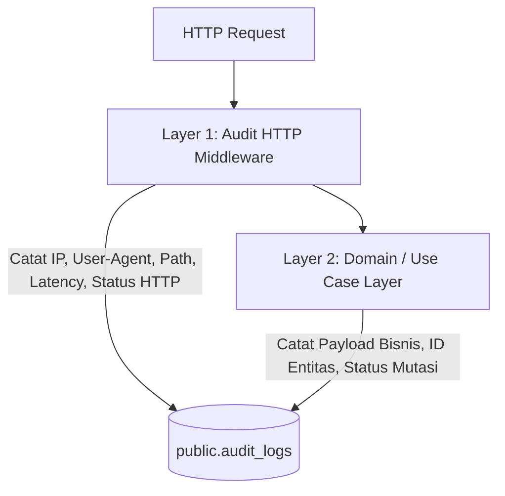

# Spesifikasi Audit Logging Komprehensif (Zero-Missed-Action Audit Trail)

**Versi:** 1.0.0  
**Tujuan:** Merekam 100% interaksi, mutasi data, transaksi keuangan, autentikasi, dan aksi administratif di seluruh layer aplikasi secara deterministik, terstruktur, dan anti-tamper.

---

## 1. Arsitektur Audit Logging Dua Lapis (Two-Layer Audit)

Untuk memastikan **tidak ada aksi yang terlewat**, audit log diimplementasikan pada dua layer:



1. **Layer 1 (HTTP Audit Middleware)**: Menangkap semua request mutasi (`POST`, `PUT`, `PATCH`, `DELETE`) secara otomatis berdasarkan konteks JWT / Tenant / Session. Menjamin endpoint baru pun langsung ter-audit otomatis.
2. **Layer 2 (Domain Usecase Logger)**: Menangkap konteks bisnis mendalam (misal: nominal sebelum & sesudah pada transaksi keuangan, alasan penolakan iuran/kependudukan).

---

## 2. Skema Tabel Audit (`public.audit_logs`)

```sql
ALTER TABLE audit_logs ADD COLUMN IF NOT EXISTS ip_address VARCHAR(45);
ALTER TABLE audit_logs ADD COLUMN IF NOT EXISTS user_agent TEXT;
ALTER TABLE audit_logs ADD COLUMN IF NOT EXISTS house_id UUID;
ALTER TABLE audit_logs ADD COLUMN IF NOT EXISTS status VARCHAR(20) DEFAULT 'SUCCESS';
ALTER TABLE audit_logs ADD COLUMN IF NOT EXISTS error_message TEXT;

CREATE INDEX IF NOT EXISTS idx_audit_logs_tenant_created ON audit_logs(tenant_id, created_at DESC);
CREATE INDEX IF NOT EXISTS idx_audit_logs_user ON audit_logs(user_id, created_at DESC);
CREATE INDEX IF NOT EXISTS idx_audit_logs_action ON audit_logs(action);
```

---

## 3. Matriks Aksi yang Direkam (100% Coverage)

| Kategori | Action Code | Resource | Detail Payload yang Direkam |
|---|---|---|---|
| **Autentikasi** | `auth.login` | `users` | email, IP, status (SUCCESS/FAILED) |
| | `auth.logout` | `users` | user_id, timestamp |
| | `auth.switch_tenant` | `tenant_users` | target_tenant_id, previous_tenant_id |
| | `auth.house_token.claim` | `houses` | house_id, block_number, user_agent |
| **Kependudukan** | `resident.create` | `residents` | resident_id, nama, status_approval |
| | `resident.update` | `residents` | resident_id, changed_fields |
| | `resident.delete` | `residents` | resident_id, soft/hard status |
| | `resident.approve` | `residents` | resident_id, approver_user_id |
| | `resident.reject` | `residents` | resident_id, reason |
| | `family.add` / `family.remove` | `family_members` | resident_id, member_id, hubungan |
| **Keuangan** | `finance.dues.create` | `dues_payments` | resident_id, category_id, amount, bulan/tahun |
| | `finance.dues.verify` | `dues_payments` | dues_id, verifier_user_id, fund_id |
| | `finance.dues.reject` | `dues_payments` | dues_id, reject_reason |
| | `finance.transaction.create` | `financial_transactions` | fund_id, type (in/out), amount, desc |
| | `finance.fund.create` / `update` | `funds` | fund_id, name, is_default |
| **Agenda & RAB** | `event.create` / `update` / `delete` | `events` | event_id, title, budget, date |
| | `event.budget.set` | `event_budgets` | event_id, item_name, estimated_cost |
| | `event.rsvp.submit` | `event_participants` | event_id, house_id / resident_id, status |
| **Rapat & Notulensi**| `meeting.create` / `update` | `meetings` | meeting_id, title, visibility |
| | `meeting.action_item.update` | `meeting_action_items` | item_id, status, assignee |
| **Aspirasi & Kebutuhan**| `aspiration.submit` | `aspirations` | house_id, title, category |
| | `aspiration.moderate` | `aspirations` | aspiration_id, status, admin_response |
| | `need.create` / `update` | `community_needs` | need_id, title, priority |
| **Pengumuman & Dokumen**| `announcement.create` / `delete` | `announcements` | announcement_id, title, is_pinned |
| | `document.create` / `update` / `delete`| `documents` | document_id, title, file_url |
| **Karang Taruna**| `karang_taruna.period.create` | `karang_taruna_periods` | period_id, name, start/end_date |
| | `karang_taruna.member.add` / `remove`| `karang_taruna_members` | member_id, role, section |
| **Sosial & Polling**| `poll.create` / `close` | `polls` | poll_id, question, options_count |
| | `poll.vote` | `poll_votes` | poll_id, house_id, option_id |
| | `social.reaction.toggle` | `reactions` | content_type, content_id, reaction_type |
| **Platform / SuperAdmin**| `superadmin.tenant.create` / `update` | `tenants` | tenant_id, name, slug, status |
| | `superadmin.user.assign_role` | `tenant_users` | target_user_id, role_id, tenant_id |

---

## 4. Jaminan Immutability & Keamanan Log

1. **Append-Only (Immutability)**:
   - Tidak ada endpoint API `PUT` atau `DELETE` untuk tabel `audit_logs`.
   - PostgreSQL trigger / rule mencegah operasi `UPDATE` dan `DELETE` pada tabel `audit_logs`.
2. **Kueri Terisolasi**:
   - Admin RT hanya bisa membaca log milik `tenant_id` mereka sendiri (`WHERE tenant_id = ?`).
   - SuperAdmin bisa melihat seluruh audit trail tingkat platform.
3. **Penyimpanan Asinkron (Non-Blocking)**:
   - Pencatatan log menggunakan Go channel / goroutine aman agar tidak menambah latency request pengguna utama.
