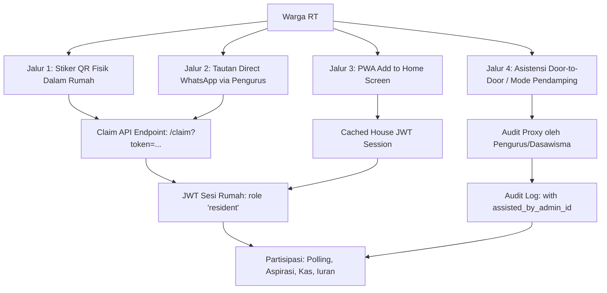

# Spesifikasi Teknis: Akses Warga Inklusif (Non-Tech, Lansia & Multi-Anggota Keluarga)

**Versi:** 1.1.0  
**Status:** Review & Action Plan  
**Target:** Aksesibilitas 100% warga (khususnya orang tua & warga non-teknis), transparansi penuh, bebas kecurangan, dan integritas data RT/RW.

---

## 1. Latar Belakang & Filosofi "Zero-Friction, Zero-Barrier"

Mayoritas warga di lingkungan RT/RW terdiri dari orang tua (lansia) dan kalangan non-teknis yang:
1. Tidak familiar dengan format registrasi username/email + kata sandi yang rumit.
2. Sering lupa password jika menggunakan sistem akun konvensional.
3. Menggunakan ponsel Android dengan kamera bawaan yang tidak otomatis mendeteksi kode QR.
4. Ragu mengunduh aplikasi native dari Play Store karena keterbatasan memori HP.

Maka sistem SiTransparan RT/RW mengusung konsep **Omni-Channel Passwordless Access**: Warga berpartisipasi (voting musyawarah, bayar iuran, kirim usulan) melalui medium yang paling mereka kuasai, tanpa mengorbankan integritas data.

---

## 2. Matriks 4 Saluran Akses (Multi-Channel Entry)



### 2.1 Jalur 1: Stiker QR Fisik (Indoor Placement)
- **Implementasi:** Dicetak oleh pengurus melalui menu `/admin/houses` -> `Cetak Lembar Stiker`.
- **Lokasi Tempel:** Bagian dalam pintu rumah, kulkas, atau map iuran/arsip keluarga (bukan di pagar luar yang rentan difoto orang lewat).
- **Peran:** Digunakan oleh anak/cucu muda dalam keluarga untuk membuka portal pertama kali di HP keluarga.

### 2.2 Jalur 2: Tautan Direct WhatsApp (Paling Ramah Lansia)
- **Implementasi:** Di menu `/admin/houses` disediakan tombol **"Kirim ke WhatsApp"** (`https://wa.me/<nomor_hp>?text=...`).
- **Pesan Otomatis:**
  > *"Bapak/Ibu [Nama KK], berikut tautan resmi Portal Transparansi RT untuk rumah Blok [A-05]. Cukup klik tautan ini untuk langsung membuka portal kas & voting musyawarah RT tanpa perlu daftar/password: [Link Akses]"*
- **User Journey:** Warga cukup klik link biru di WhatsApp -> langsung masuk ke portal RT tanpa login.

### 2.3 Jalur 3: PWA "Pasang di Layar Depan HP" (Zero Re-scan)
- **Implementasi:** Saat tautan pertama kali dibuka di browser HP warga, sistem menampilkan banner panduan sederhana:
  > *"Pasang Aplikasi RT di Layar Depan HP Anda agar tidak perlu scan ulang."*
- **Teknis:** Menggunakan event browser `beforeinstallprompt` (Workbox Service Worker telah aktif). Ikon RT muncul berdampingan dengan WhatsApp di layar ponsel warga.

### 2.4 Jalur 4: Mode Pendamping (Khusus Lansia Tanpa Ponsel)
- **Masalah:** Lansia yang tidak memiliki smartphone sama sekali tidak boleh kehilangan hak bersuara.
- **Implementasi Teknis:**
  - Pengurus RT / Kader Dawis mendatangi rumah warga saat musyawarah door-to-door.
  - Admin membuka menu pendamping: `/admin/houses?assist=<house_id>`.
  - Admin memilih opsi suara sesuai kehendak warga lansia bersangkutan.
  - Sistem mencatat suara dengan audit flag: `voted_via: "assisted"`, `recorded_by_user_id: "<admin_id>"`, `witness_note: "Disaksikan oleh Dawis Ibu Siti"`.

---

## 3. Resolusi Edge Cases & Konflik Suara (Voting Governance)

### 3.1 Resolusi Konflik Anggota Keluarga (1 Rumah vs Banyak Anggota)
- **Skenario:** Ayah ingin memilih Opsi A, sedangkan Anak memilih Opsi B pada polling musyawarah RT.
- **Aturan Sistem:**
  1. Polling tingkat RT secara hukum musyawarah warga berpedoman pada **1 KK/Rumah = 1 Hak Suara** (terkait besaran iuran, pemilihan vendor gerbang, atau jadwal ronda).
  2. Begitu salah satu anggota keluarga memberikan suara melalui token rumah tersebut, sistem mengunci opsi:
     ```json
     {
       "status": "already_voted",
       "message": "Hak suara untuk Blok A-05 telah digunakan pada 05 Sep 2026, 09:15 WIB.",
       "selected_option": "Opsi A (Setuju Iuran Rp 50.000)"
     }
     ```
  3. Anggota keluarga lain yang membuka tautan dapat melihat pilihan yang sudah tercatat tanpa bisa mengubahnya sembarangan (kecuali Kepala Keluarga meminta reset suara kepada panitia RT).

### 3.2 Penanganan 1 Rumah Dihuni Lebih dari 1 KK
- **Skenario:** Rumah besar dihuni oleh 2 Kepala Keluarga (Orang Tua + Anak yang sudah mandiri ber-KK sendiri).
- **Aturan Sistem:**
  - Admin RT mendaftarkan unit secara logis:
    - Unit 1: `Blok A-05 (KK Utama: Bpk. Supardi)` -> Token 1
    - Unit 2: `Blok A-05 Paviliun (KK: Sdr. Hendra)` -> Token 2
  - Masing-masing KK menerima stiker/link terpisah dan memiliki hak suara independen.

### 3.3 Penanganan Rumah Kontrakan / Alih Sewa
- **Skenario:** Penyewa rumah pindah, penyewa baru masuk. Penyewa lama masih menyimpan link akses di WA.
- **Solusi:**
  - Di menu `/admin/houses`, Admin RT klik **"Generate Ulang Token (Reset QR)"**.
  - Token lama langsung berstatus `revoked`. HP penyewa lama yang mencoba membuka portal akan melihat pesan: *"Token QR tidak valid atau sudah diganti oleh pengurus RT"*.
  - Penyewa baru menerima link/stiker token baru.

### 3.4 Pencegahan Akses Ilegal / Tamu Iseng
1. **Pemberitahuan Transparan di Header:** Setiap halaman portal warga menampilkan identitas jelas: *"Anda masuk sebagai: Rumah Blok B3 No. 12 (Keluarga Bpk. Rahmat)"*.
2. **Rate Limiting & IP Profiling:** Percobaan voting bertubi-tubi dari IP asing di luar rentang lokal dibatasi oleh `authRateLimitMw`.
3. **PIN Konfirmasi 4 Digit (Opsional Tingkat Tinggi):** Untuk polling krusial (misalnya pemilihan Ketua RT), setelah scan QR, warga diminta memasukkan **4 digit terakhir Nomor KK** sebagai otentikasi dua arah sederhana (mudah diingat warga, mustahil ditebak tamu luar).

---

## 4. Rencana Kerja Implementasi (Checklist Tindakan)

- [x] **Fase 1: Backend Foundation (Selesai & Lulus E2E)**
  - Schema tabel `houses` dan `house_qr_tokens`.
  - Endpoint `GET /api/v1/house-access/claim` menghasilkan JWT session scoped ke rumah dan tenant.
  - Soft-delete `WHERE deleted_at IS NULL` dan fitur Regenerate Token.
  - E2E Playwright `houses-qr.spec.ts` 100% green.

- [ ] **Fase 2: Tombol Direct WhatsApp di UI Admin (`HousesPage.tsx`)**
  - Tambahkan tombol chat WA instan: jika data rumah terhubung dengan nomor HP Kepala Keluarga, admin bisa 1-klik mengirimkan tautan akses ke nomor WA warga bersangkutan.

- [ ] **Fase 3: PWA Install Prompt Banner pada `/claim`**
  - Setelah verifikasi klaim sukses, tambahkan banner tombol jelas: *"Pasang Ikon RT di Layar Depan"* agar warga lansia tidak perlu scan ulang setiap hari.

- [ ] **Fase 4: Transparansi Hasil Polling per Rumah**
  - Halaman polling admin menampilkan rekapitulasi rumah mana yang sudah memberikan suara dan rumah mana yang belum, memudahkan panitia RT memantau partisipasi warga.
