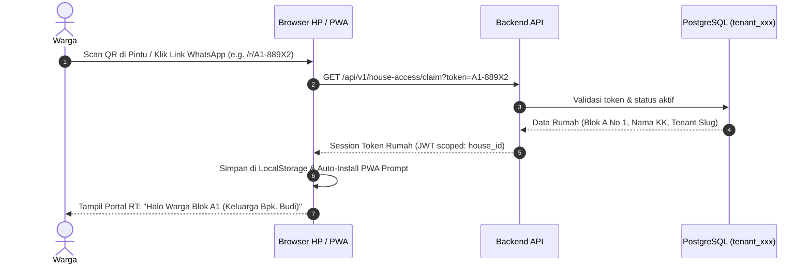
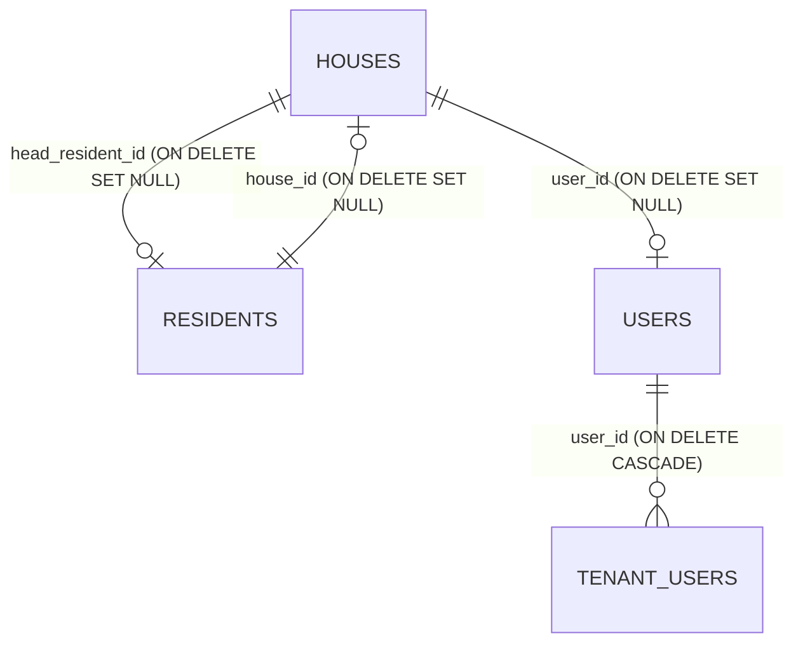

# Spesifikasi Teknis: Akses Warga Berbasis QR Rumah (1 Rumah = 1 Token)

**Versi:** 1.0.0  
**Tujuan:** Menghilangkan friksi registrasi dan login (email/password/OTP) untuk warga awam dengan model Stiker QR Rumah & Token Link, sekaligus mencegah spam dan duplikasi voting.

---

## 1. Filosofi Desain & Alur Pengguna (User Journey)

### 1.1 Sisi Pengurus RT
1. Admin RT menambahkan/mengimpor data warga (Kepala Keluarga, Alamat / Blok / No. Rumah).
2. Sistem otomatis meng-generate **Token Akses Unik (House Token)** untuk setiap rumah.
3. Admin RT memiliki tombol **"Cetak Stiker QR Rumah"** (format siap cetak PDF ukuran kartu/stiker) atau tombol **"Kirim Link via WhatsApp"**.

### 1.2 Sisi Warga


---

## 2. Hak Akses & Matriks Kemampuan

| Aksi / Fitur | Tanpa Link / Publik Umum | Dengan Token QR Rumah (Warga) | Akun Pengurus RT (Admin) |
|---|---|---|---|
| **Baca Pengumuman & Agenda** | Ya (Semua) | Ya (Semua) | Ya (Semua + Kelola) |
| **Lihat Transparansi Kas RT** | Ya (Summary + Laporan) | Ya (Detail transaksi) | Ya (+ Catat transaksi) |
| **Ikut Polling / Pemilihan** | Hanya Lihat Hasil | **Bisa Voting (1 Suara/Rumah)** | Monitoring & Tutup Polling |
| **Kirim Aspirasi / Pengaduan** | Read-only | **Bisa Kirim (Teridentifikasi Blok A1)** | Review, Balas, Ubah Status |
| **Konfirmasi Acara (RSVP)** | Tidak | **Bisa (Cukup pilih hadir/tidak)** | Lihat Rekap Kehadiran |
| **Bayar Iuran & Upload Bukti** | Tidak | **Bisa (Pilih bulan & upload slip)** | Verifikasi Pembayaran |
| **Kelola Data Kependudukan** | Tidak | Hanya Lihat Anggota Rumah Sendiri | Full CRUD Warga |

---

## 3. Desain Keamanan & Anti-Abuse

### 3.1 Pencegahan Duplikasi Suara (Anti-Double Voting)
- Backend mengikat voting pada `house_id` (bukan cookie/IP yang mudah dihapus).
- Jika ada anggota keluarga lain di rumah yang sama membuka link tersebut, sistem menampilkan pesan: *"Rumah Blok A1 sudah menggunakan hak suara untuk polling ini."*

### 3.2 Pertahanan Stiker QR Difoto Orang Asing
1. **Regenerasi Token**: Jika stiker QR rusak atau bocor, Admin RT bisa klik tombol **"Reset Token Rumah"** dalam 1 klik. Token lama langsung hangus (revoked).
2. **Aksi Sensitif**: Upload mutasi atau perubahan data anggota keluarga dapat meminta konfirmasi 4 digit terakhir NIK Kepala Keluarga sebagai PIN konfirmasi sekunder (opsional).
3. **Audit Log**: Setiap aktivitas mencatat metadata: waktu, user-agent, dan `house_id`.

---

## 4. Skema Database & Model Data

### 4.1 Hubungan 3 Entitas: Rumah (houses), Penduduk (residents), Pengguna (users)

Sistem memisahkan secara tegas 3 lapisan data agar tidak terjadi tumpang tindih:

1. **Rumah (`houses`) — Fisik Hunian:**
   - Menyimpan penomoran/identitas fisik (`block_number`, misal: `No. 38` atau `Blok A1/05`), alamat/keterangan lokasi (`address`, misal: `Gg. Langgar`), token QR stiker (`access_token`), PIN 4-digit verifikasi (`pin_code`), dan tautan Kepala Keluarga (`head_resident_id`).
2. **Penduduk (`residents`) — Sensus Warga:**
   - Menyimpan profil sensus kependudukan riil: NIK terenkripsi AES-256-GCM + HMAC search, No KK, Nama Lengkap, nomor HP, status Kepala Keluarga (`is_head_of_family`), dan tautan rumah hunian (`house_id`).
3. **Pengguna (`users` / `tenant_users`) — Kredensial Login:**
   - Menyimpan akun login web konvensional (Email, Password Hash, Role). Dapat dibuat otomatis oleh sistem saat QR stiker di-scan pertama kali (`rumah-<tenant>-<blok>@warga.local`), atau dibuat manual oleh pengurus RT di `/admin/users` via `SearchableResidentSelect` untuk auto-fill nama dan kontak warga.



### 4.2 Aturan Penghapusan & Integritas Data (Lifecycle Skema Hapus)

Penghapusan bersifat **independen dan aman (ON DELETE SET NULL)**, tidak ada cascade delete antar entitas utama untuk mencegah hilangnya data audit dan pembukuan kas:

| Entitas Dihapus | Dampak ke Rumah (`houses`) | Dampak ke Penduduk (`residents`) | Dampak ke Pengguna (`users`) | Alasan Tata Kelola |
|---|---|---|---|---|
| **Hapus Rumah** | Soft delete (`deleted_at = NOW()`), QR token dinonaktifkan. | **Tetap Ada.** Kolom `resident.house_id` menjadi `NULL`. | **Tetap Ada.** Riwayat login/audit user tetap aman. | Warga pindah/rumah dibongkar tidak boleh menghapus data sensus penduduk dan riwayat iuran warga. |
| **Hapus Penduduk** | **Tetap Ada.** Kolom `house.head_resident_id` menjadi `NULL`. | Soft delete (`deleted_at = NOW()`). | **Tetap Ada.** | Stiker QR fisik yang sudah tertempel di pintu tetap bisa dipakai oleh penghuni baru berikutnya. |
| **Hapus Pengguna** | **Tetap Ada.** Kolom `house.user_id` menjadi `NULL`. | **Tetap Ada.** Profil NIK/KK kependudukan tidak berubah. | Hak login dicabut (`tenant_users` atau `users` deleted). | Mencabut akses login portal tidak boleh menghilangkan catatan sensus penduduk RT. |

### 4.3 Modifikasi Schema Tenant (`tenant_<slug>`)

```sql
-- Tabel entitas rumah / kartu keluarga
CREATE TABLE IF NOT EXISTS houses (
    id UUID PRIMARY KEY DEFAULT gen_random_uuid(),
    block_number VARCHAR(50) NOT NULL, -- "Atas Nama" / Nomor / Blok Hunian (contoh: "no.38", "Blok A1 No. 05")
    address TEXT,                     -- Alamat / Nama Jalan / Keterangan Lokasi (contoh: "Gg. Langgar")
    head_resident_id UUID REFERENCES residents(id) ON DELETE SET NULL,
    user_id UUID REFERENCES public.users(id) ON DELETE SET NULL,
    access_token VARCHAR(64) UNIQUE NOT NULL, -- Token acak URL-safe (cth: "hsk_9f82kd92a...")
    token_status VARCHAR(20) DEFAULT 'active' CHECK (token_status IN ('active', 'revoked', 'suspended')),
    pin_code VARCHAR(10),             -- PIN 4-digit untuk verifikasi / reset
    token_version INT DEFAULT 1,      -- Versioning token untuk kill-switch sesi
    deleted_at TIMESTAMPTZ,
    created_at TIMESTAMP WITH TIME ZONE DEFAULT CURRENT_TIMESTAMP,
    updated_at TIMESTAMP WITH TIME ZONE DEFAULT CURRENT_TIMESTAMP
);

-- Relasi warga ke rumah
ALTER TABLE residents ADD COLUMN IF NOT EXISTS house_id UUID REFERENCES houses(id) ON DELETE SET NULL;

-- Log voting polling berbasis rumah
ALTER TABLE poll_votes ADD COLUMN IF NOT EXISTS house_id UUID REFERENCES houses(id) ON DELETE CASCADE;
CREATE UNIQUE INDEX IF NOT EXISTS uq_poll_house_vote ON poll_votes(poll_id, house_id);
```

---

## 5. Rencana Endpoint API

### 5.1 Public / Resident API
- `GET /api/v1/t/{slug}/house-access/verify?token=...`
  - Validasi token rumah.
  - Return: JWT scoped resident (`role: resident_house`, `house_id: ...`, `tenant_id: ...`).
- `GET /api/v1/house-profile`
  - Return: Identitas rumah, nama kepala keluarga, tagihan iuran aktif, daftar kegiatan terdaftar.

### 5.2 Admin RT API
- `GET /api/v1/admin/houses` — List seluruh rumah, status token, & QR payload.
- `POST /api/v1/admin/houses/generate-tokens` — Bulk generate token rumah baru.
- `POST /api/v1/admin/houses/{id}/revoke` — Reset / ganti token rumah yang bocor.
- `GET /api/v1/admin/houses/print-stickers` — Export data QR format cetak (PDF / Label template).

---

## 6. Integrasi Frontend & PWA Experience

1. **Auto-Persist**: Saat URL `/r/{token}` dibuka, browser menyimpan token ke `localStorage` (`sitransparan_house_token`).
2. **PWA Standalone**: Saat warga menambahkan web ke Home Screen HP, web langsung terbuka otomatis di mode Rumah mereka tanpa perlu scan ulang.
3. **Banner Identitas**: Di bagian atas web tertera header ramah:
   > 🏠 **Rumah Blok B2 / No. 05 (Bpk. Joko)** | [Bukan rumah Anda? Keluar]
