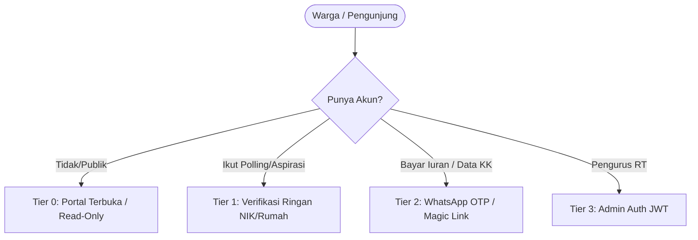

# RFC: Arsitektur UX Warga Awam & Mekanisme Anti-Abuse

## 1. Latar Belakang & Masalah
Mayoritas warga RT/RW:
- Sulit mengingat kombinasi email dan password.
- Enggan mengisi form registrasi panjang.
- Kesulitan dengan verifikasi email aktivasi.
- Memerlukan kemudahan akses seperti membuka portal berita atau media sosial, namun sistem harus mencegah bot, spam, duplikasi voting, dan klaim identitas palsu.

---

## 2. Arsitektur Akses Bertingkat (Tiered Access)

### Ringkasan Level Akses

| Level | Aktor | Metode Autentikasi / Identifikasi | Fitur yang Diakses | Proteksi & Anti-Abuse |
|---|---|---|---|---|
| **Tier 0** | Publik / Tamu | Tanpa input identitas (akses via URL subdomain RT) | Baca pengumuman, transparansi kas, agenda kegiatan, daftar aspirasi umum | Rate limit IP (100 req/min), Cache static/SSR |
| **Tier 1** | Warga Partisipatif (Tanpa Akun) | Input 4-digit akhir NIK + No. Rumah / Blok atau Token Rumah | Polling suara warga, kirim usulan aspirasi, RSVP agenda | Hash `(Tenant + Rumah + NIK4)`, Honeypot, CAPTCHA Turnstile, Max 1 vote per entitas |
| **Tier 2** | Warga Terverifikasi | WhatsApp Magic Link / OTP singkat (4 digit) | Bayar iuran online, akses notulensi rapat internal, kelola anggota keluarga | Binding No. HP ke database kependudukan resmi RT, Rate limit OTP 3x/hari |
| **Tier 3** | Pengurus & RT Admin | Email + Password + JWT RBAC | Dashboard admin, verifikasi iuran, approval kependudukan, input pengeluaran | Brute-force lockout, Audit logs, Schema isolation |

---

## 3. Desain Mekanisme Anti-Abuse

### 3.1 Polling & Voting Tanpa Login
- **Tantangan**: Mencegah 1 orang melakukan spam voting berkali-kali.
- **Solusi**:
  1. Frontend meminta: `Nomor Rumah/Blok` + `4 Angka Terakhir NIK`.
  2. Backend membuat SHA-256 hash: `HMAC(tenant_id + block_number + nik_last_4, salt)`.
  3. Backend mencatat hash tersebut pada tabel `poll_votes` dengan `UNIQUE (poll_id, voter_hash)`.
  4. Identitas asli warga tetap privat (zero-knowledge proof sederhana), namun sistem menjamin 1 NIK/Rumah hanya 1 suara.

### 3.2 Pengiriman Aspirasi & Kebutuhan Warga
- **Tantangan**: Spam konten vulgar, iklan pinjol, atau bot otomatis.
- **Solusi**:
  1. **Honeypot Field**: Input tersembunyi `website` / `url` pada form. Jika terisi oleh bot otomatis, backend langsung reject.
  2. **Moderasi Bertahap**: Aspirasi dari Tier 0/1 masuk status `pending_review`. Admin RT dapat menyetujui (`approved`) agar tampil di feed publik, atau menolak (`rejected`).
  3. **Rate Limiting**: Maksimal 3 pengiriman aspirasi per IP/Device per jam.

### 3.3 Konfirmasi Kehadiran Acara (RSVP) & Reaksi Sosial
- **Tantangan**: Bot menaikkan jumlah peserta palsu atau reaksi spam.
- **Solusi**:
  1. Penyimpanan identitas anonim pada `LocalStorage` (`client_instance_id`).
  2. Satu `client_instance_id` hanya dapat memberi 1 reaksi (`like`, `applause`, `support`) per konten.
  3. RSVP mewajibkan nama singkat + nomor kontak / rumah.

---

## 4. Rencana Implementasi Bertahap

1. **Fase 1 (Anti-Spam & Moderasi Aspirasi)**:
   - Tambahkan status `pending_review` dan alur approval untuk aspirasi publik.
   - Pasang honeypot dan IP rate-limit di endpoint publik.
2. **Fase 2 (Polling Warga via Hash NIK/No. Rumah)**:
   - Endpoint vote menerima `house_number` dan `nik_last4`, hitung hash deterministik, validasi duplikasi.
3. **Fase 3 (Login WhatsApp Magic Link / OTP)**:
   - Tambahkan channel WhatsApp via provider (Fonnte/Waha/Twilio) untuk akses warga tanpa password.
