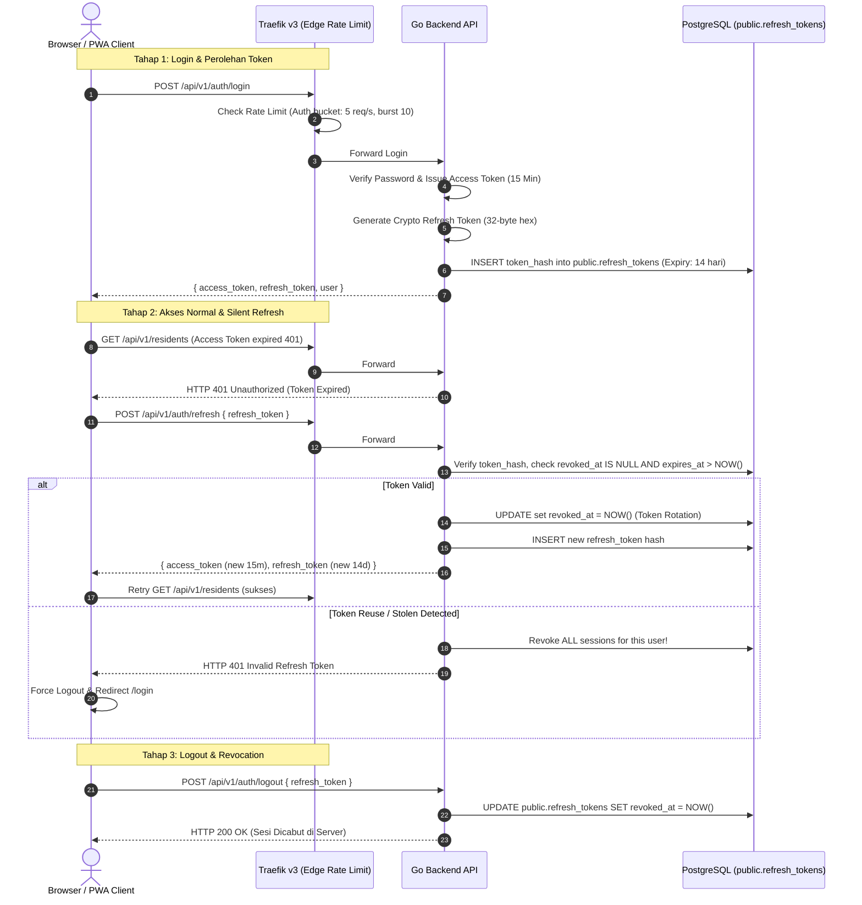

# Spesifikasi Desain: Refresh Token, Sesi Revocation & Traefik v3 Rate Limiter

> **Status:** Draft / Ready for Implementation Plan
> **Target Branch:** `dev`
> **Terkait Dokumen:** [[01-architecture/authentication-and-rbac]], [[05-operations-devops/docker-and-traefik]], [[03-database/migrations-history]]

---

## 1. Latar Belakang & Masalah

Saat ini:
1. **Access Token 24 Jam Tanpa Revocation**:
   - Token JWT HS256 berlaku 24 jam penuh.
   - Logout di sisi frontend hanya menghapus token di `localStorage` dan cookie.
   - Jika token disadap (XSS, malware HP, session hijacking), token tetap sah dipakai untuk membaca data NIK warga atau memanipulasi kas RT sampai batas 24 jam habis.
   - Admin RT atau Superadmin tidak memiliki wewenang memutus sesi akun yang dicurigai disusupi.
2. **Rate Limiting Hanya di In-Memory Go**:
   - Jika backend di masa depan di-scale ke 2+ container di balik Traefik, memori masing-masing container terpisah sehingga kuota rate limiter bocor.
   - Traefik v3 sebagai pintu gerbang reverse proxy belum menyaring banjir request di tepi (edge).

---

## 2. Solusi Desain Arsitektur



---

## 3. Komponen Teknis Detail

### A. Database Migration `000051_create_refresh_tokens`
```sql
CREATE TABLE IF NOT EXISTS public.refresh_tokens (
    id UUID PRIMARY KEY DEFAULT gen_random_uuid(),
    user_id UUID NOT NULL REFERENCES public.users(id) ON DELETE CASCADE,
    token_hash VARCHAR(64) NOT NULL UNIQUE,
    expires_at TIMESTAMPTZ NOT NULL,
    revoked_at TIMESTAMPTZ,
    ip_address VARCHAR(45),
    user_agent TEXT,
    created_at TIMESTAMPTZ NOT NULL DEFAULT NOW()
);

CREATE INDEX idx_refresh_tokens_user_id ON public.refresh_tokens(user_id);
CREATE INDEX idx_refresh_tokens_hash ON public.refresh_tokens(token_hash);
CREATE INDEX idx_refresh_tokens_expires_at ON public.refresh_tokens(expires_at);
```

### B. Backend Go Layering
1. **Access Token Lifespan**:
   - Diperpendek dari 24 jam menjadi **15 menit**.
2. **Refresh Token Generation**:
   - Opaque 32-byte crypto-random hex string (`crypto/rand`).
   - Di database hanya disimpan SHA-256 hash-nya (`token_hash`), sehingga jika database bocor, penyerang tidak dapat memakai token mentah.
3. **Endpoint Kontrak**:
   - `POST /api/v1/auth/refresh`: Menerima `{ "refresh_token": "..." }`. Melakukan rotasi token otomatis.
   - `POST /api/v1/auth/logout`: Menerima `{ "refresh_token": "..." }` dan menandai `revoked_at = NOW()`.
   - `POST /api/v1/admin/users/{id}/revoke-sessions`: Mencabut seluruh refresh token milik user tertentu (`UPDATE ... SET revoked_at = NOW() WHERE user_id = $1`). Memerlukan peran `admin_rt` atau `superadmin`.

### C. Frontend Axios Interceptor Queue (`api.ts` & `useAuthStore.ts`)
- Simpan `refresh_token` di storage lokal bersama `token`.
- Axios response interceptor:
  - Jika menerima `401 Unauthorized` dan error bukan berasal dari rute publik atau rute auth:
  - Tahan request yang gagal dalam queue (`failedQueue`).
  - Jika belum ada proses refresh yang berjalan, panggil `POST /auth/refresh`.
  - Jika refresh berhasil: perbarui token di `useAuthStore`, ulangi seluruh request yang antre dengan token baru.
  - Jika refresh gagal: panggil `logout()`, hapus seluruh session, alihkan ke `/login`.

### D. Traefik v3 Native Edge Rate Limiter
Tambahkan middleware Traefik di `infrastructure/docker-compose*.yml`:
```yaml
labels:
  # General API Rate Limit: 100 req/s, burst 50
  - "traefik.http.middlewares.api-ratelimit.ratelimit.average=100"
  - "traefik.http.middlewares.api-ratelimit.ratelimit.burst=50"
  - "traefik.http.middlewares.api-ratelimit.ratelimit.period=1s"

  # Auth Route Rate Limit: 5 req/s, burst 10
  - "traefik.http.middlewares.auth-ratelimit.ratelimit.average=5"
  - "traefik.http.middlewares.auth-ratelimit.ratelimit.burst=10"
  - "traefik.http.middlewares.auth-ratelimit.ratelimit.period=1s"
```

---

## 4. Keamanan & Edge Cases
1. **Deteksi Pencurian Token (Reuse Detection)**:
   - Jika ada request `/auth/refresh` yang membawa token yang statusnya sudah `revoked_at IS NOT NULL`, ini indikasi keras bahwa token telah disalin oleh peretas.
   - Backend akan mencabut **SEMUA** refresh token milik user tersebut seketika dan mengembalikan HTTP 401.
2. **Pembersihan Token Kedaluwarsa (Garbage Collection)**:
   - Query berkala atau cron trigger membersihkan record di mana `expires_at < NOW() - INTERVAL '30 days'`.

---

## 5. Hubungan Lintas Dokumen
- [[01-architecture/authentication-and-rbac|Dokumentasi Auth & RBAC]]
- [[03-database/schema-inventory|Katalog Skema Database]]
- [[05-operations-devops/docker-and-traefik|Konfigurasi Traefik]]
